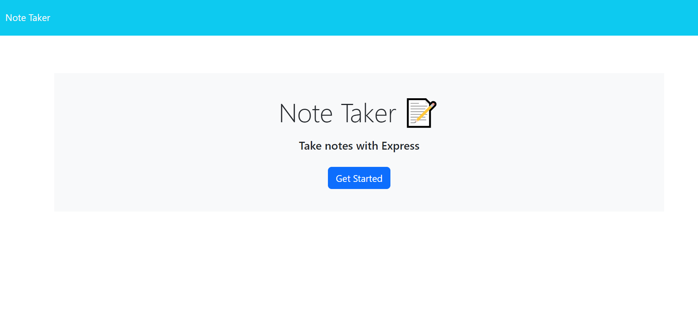
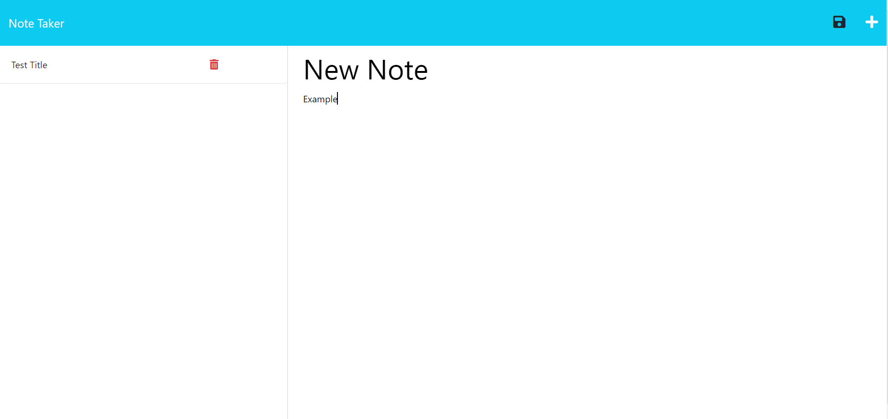
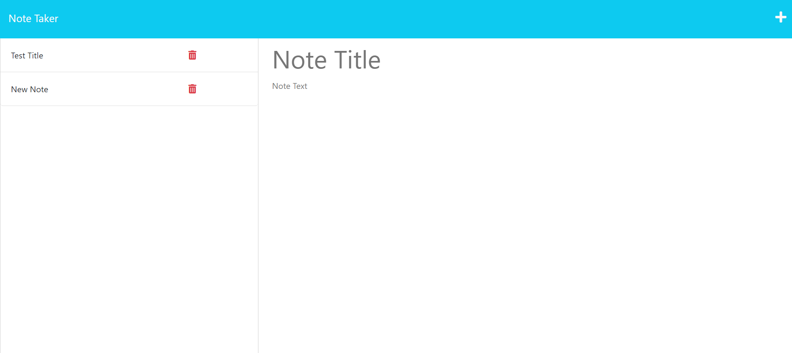

# Note_Taker_App_ServerJS

## Website Link

 https://pacific-reaches-43282-9211d9d6fa8c.herokuapp.com/

## Repo Link

 https://github.com/matthewlazarowitz/Note_Taker_App_ServerJS

## Screenshot

## Description

For this challenge we were tasked with using starter code for a Note taking app.  With this code were asked to use API servers to take this notes and store them to a .json file and then recall them in the left column of the screen for users.  The goal was to create a server.js file and use the express, fs, path, and uuid dependencies to route to the HTML and API's in order to accomplish saving the new files, pulling them to the html, and deleting if we chose to do so (I was able to).  This task tested our ability to use what we have learned with Node.js, Express.js, and Object Oriented Programming in order to complete this challenge. In order to do this there were a few initial setups I needed to make.  First the trivial things were adding a server.js file, git init, npm install express uuid, creating a gitignore file for node_modules, then I was able to start working in server.js.  I began by pulling in my dependencies at the top.  My next step was to set up the express app (this is very important for Heroku deployment especially).  After I set up my HTML routes using app.get to both the index.html file and the notes.html file.  The next step was to setup my API routes.  The app.get route retrieves the notes from the db.json file.  Next the app.post route creates new notes and saves them to the db.json file. Finally, the app.delete route removes notes from the db.json file.  Lastly I set up the app.listen to start the server.  Once the app was working I deployed it to Heroku. 

## Installation

N/A

## Usage

The application is a completely viable way to take notes and store them.  Whether you leave and come back to the page, the notes will be in the db.json so you could with ease use this as your everyday note app.  Even though the starter code made it look nice, I am really proud to have gotten the app to be functional. 

## Credits

(JD Tadlock)  (RUT-VIRT-FSF-FT-05-2023-U-LOLC)

## License

MIT License

Copyright (c) 2023 matthewlazarowitz

Permission is hereby granted, free of charge, to any person obtaining a copy
of this software and associated documentation files (the "Software"), to deal
in the Software without restriction, including without limitation the rights
to use, copy, modify, merge, publish, distribute, sublicense, and/or sell
copies of the Software, and to permit persons to whom the Software is
furnished to do so, subject to the following conditions:

The above copyright notice and this permission notice shall be included in all
copies or substantial portions of the Software.

THE SOFTWARE IS PROVIDED "AS IS", WITHOUT WARRANTY OF ANY KIND, EXPRESS OR
IMPLIED, INCLUDING BUT NOT LIMITED TO THE WARRANTIES OF MERCHANTABILITY,
FITNESS FOR A PARTICULAR PURPOSE AND NONINFRINGEMENT. IN NO EVENT SHALL THE
AUTHORS OR COPYRIGHT HOLDERS BE LIABLE FOR ANY CLAIM, DAMAGES OR OTHER
LIABILITY, WHETHER IN AN ACTION OF CONTRACT, TORT OR OTHERWISE, ARISING FROM,
OUT OF OR IN CONNECTION WITH THE SOFTWARE OR THE USE OR OTHER DEALINGS IN THE
SOFTWARE.

